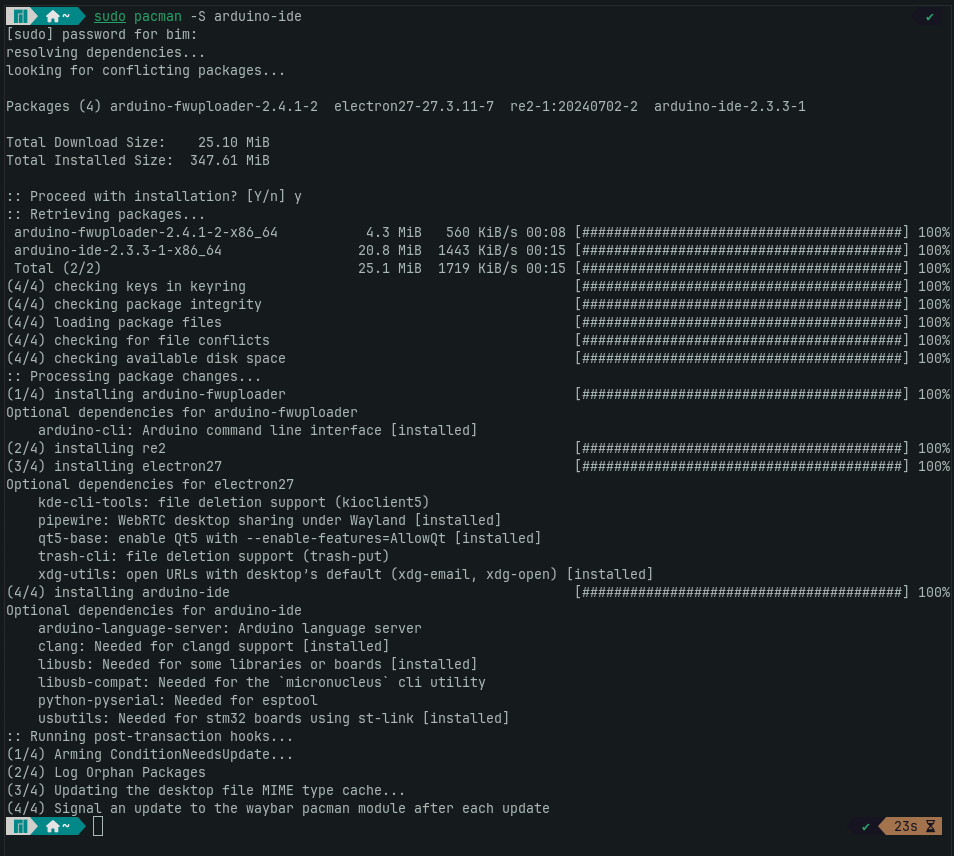

# #1 Turning on Arduino Uno R3 and get connect to laptop

## sdsd

<figure><figcaption></figcaption></figure>

<figure><figcaption></figcaption></figure>

## sd

<figure><figcaption></figcaption></figure>

## sd

<figure><figcaption></figcaption></figure>

sdsd

````
// output
```
Downloading packages
arduino:arduinoOTA@1.3.0
arduino:avr-gcc@7.3.0-atmel3.6.1-arduino7
arduino:avrdude@6.3.0-arduino17
arduino:avr@1.8.6
Installing arduino:arduinoOTA@1.3.0
Configuring tool.
arduino:arduinoOTA@1.3.0 installed
Installing arduino:avr-gcc@7.3.0-atmel3.6.1-arduino7
Configuring tool.
arduino:avr-gcc@7.3.0-atmel3.6.1-arduino7 installed
Installing arduino:avrdude@6.3.0-arduino17
Configuring tool.
arduino:avrdude@6.3.0-arduino17 installed
Installing platform arduino:avr@1.8.6
Configuring platform.
Platform arduino:avr@1.8.6 installed
Downloading SD@1.3.0
SD@1.3.0
Installing SD@1.3.0
Installed SD@1.3.0
Downloading Keyboard@1.0.6
Keyboard@1.0.6
Installing Keyboard@1.0.6
Installed Keyboard@1.0.6
Downloading Firmata@2.5.9
Firmata@2.5.9
Installing Firmata@2.5.9
Installed Firmata@2.5.9
Downloading Mouse@1.0.1
Mouse@1.0.1
Installing Mouse@1.0.1
Installed Mouse@1.0.1
Downloading TFT@1.0.6
TFT@1.0.6
Installing TFT@1.0.6
Installed TFT@1.0.6
Downloading LiquidCrystal@1.0.7
LiquidCrystal@1.0.7
Installing LiquidCrystal@1.0.7
Installed LiquidCrystal@1.0.7
Downloading Servo@1.2.2
Servo@1.2.2
Installing Servo@1.2.2
Installed Servo@1.2.2
Downloading Stepper@1.1.3
Stepper@1.1.3
Installing Stepper@1.1.3
Installed Stepper@1.1.3
Downloading Arduino_BuiltIn@1.0.0
Arduino_BuiltIn@1.0.0
Installing Arduino_BuiltIn@1.0.0
Installed Arduino_BuiltIn@1.0.0
Downloading Ethernet@2.0.2
Ethernet@2.0.2
Installing Ethernet@2.0.2
Installed Ethernet@2.0.2

```
````


## sd

<figure><figcaption></figcaption></figure>
